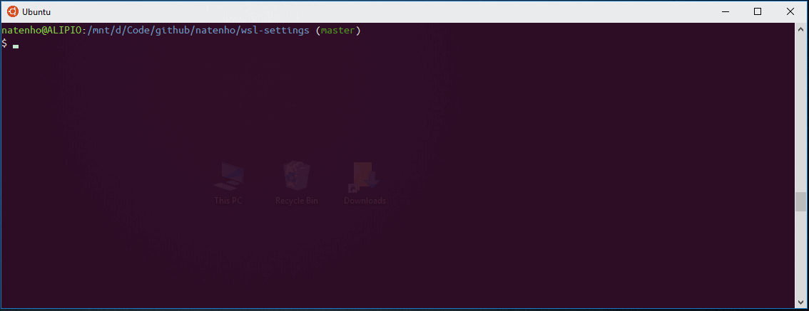

# WSL-Settings
This repository store some settings to setup a more confortable Windows Subsystem for Linux terminal:

- Enables Ubuntu look and feel to the terminal window with transparency
- Fixes dark blue over black colors that are almost invisible on some displays
- Fixes the background color of full writeable directories showed by the `ls` command
- Enables git aware prompt
- Adds "start" command alias, to be compatible with regular Windows terminal i.e. you can type ```start calc``` and open Windows Calculator

# How to setup?

1. Open WSL terminal, clone this repository into a folder easily accessible on windows (e.g. /mnt/c/foo)
2. Open the repository folder on Windows Explorer and install Windows\UbuntuMono-\*.ttf fonts
3. Import Windows\ubuntu.reg in Windows Registry
4. Inside a WSL terminal, copy the content of Ubuntu to the home directory
  ```cp -r path-to-wsl-settings/Ubuntu/* ~/```
5. Restart WSL terminal


